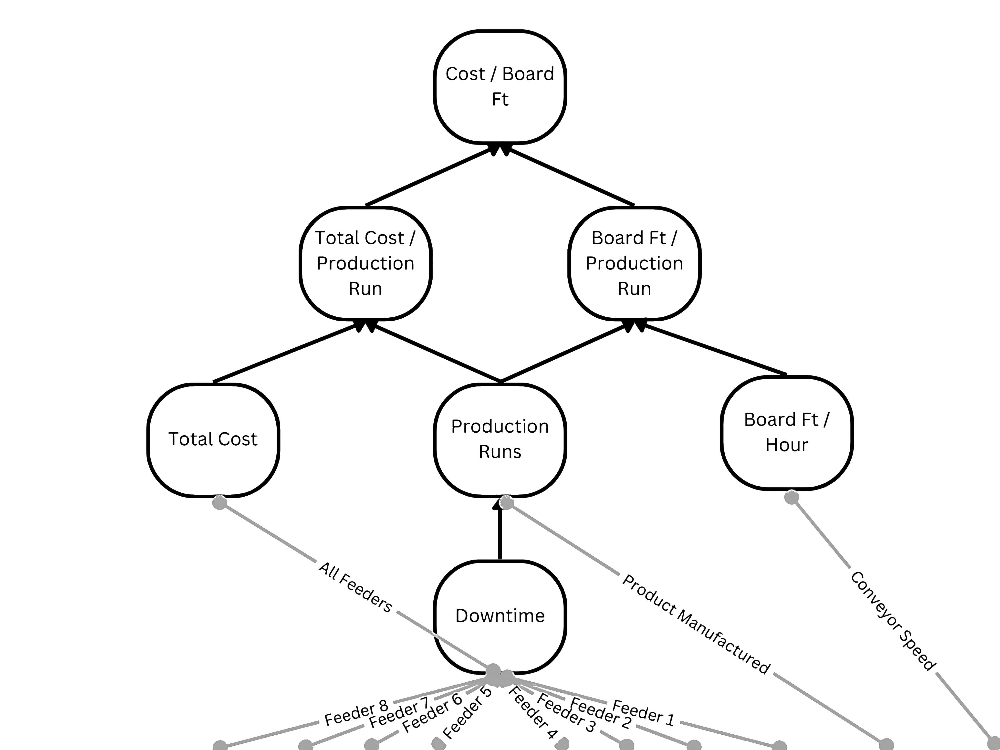

Calculation Metric
==================

Asset Diagram:
--------------

.. note::

   Visual Representation of Seeq Foam Production Asset Group Hierarchy

There are 8 calculated metrics that are derived from 11 tag signals. The original 11 tag signals are:

#. Feeder_1_PV
#. Feeder_2_PV
#. Feeder_3_PV
#. Feeder_4_PV
#. Feeder_5_PV
#. Feeder_6_PV
#. Feeder_7_PV
#. Feeder_8_PV

#. Conveyor_Speed_PV
#. Product_Manufactured
#. Tunnel_Vacuum_PV

.. note::
   Blowing agent signals are currently included in asset hierarchy but lack of signals across production lines pose issues with adoption into calculation       hierarchy

Each of the tags was pulled from each line and separate calculations were performed to get the following metrics:

Downtime: 
*********
Periods of time in which no material is flowing AND Conveyor is not running

**Seeq Formula**

.. code-block:: console

   //Combines all Feeder Signals ($f1 through $f8) and evalute for 0 material flowing
   //resample(5min) is used to decrease future compute time
   //replaceNotValid(0) is used to avoid nan values for missing signal values
   
   (($f1.resample(5min).replaceNotValid(0)+
   $f2.resample(5min).replaceNotValid(0)+
   $f3.resample(5min).replaceNotValid(0)+
   $f4.resample(5min).replaceNotValid(0)+
   $f5.resample(5min).replaceNotValid(0)+
   $f6.resample(5min).replaceNotValid(0)+
   $f7.resample(5min).replaceNotValid(0)+
   $f8.resample(5min).replaceNotValid(0)+
   $ba1.resample(5min).replaceNotValid(0)+
   $ba2.resample(5min).replaceNotValid(0)+
   $ba3.resample(5min).replaceNotValid(0)) == 0)
   
   //Combine conditions of no material flow with condiition for conveyor not moving
   .combineWith(($cs.resample(5min).replaceNotValid(0) == 0)
   
   //Remove outlying peroids of very brief stop in production
   .removeShorterThan(30min))
   .merge(0min)

Production Runs
***************
Periods where not downtime is occurring AND Product_Manufactured signal identifies a product being made

**Seeq Formula**

.. code-block:: console

   //Remove empty strings in Product_Manufactured signal and resample to 10 minutes
   ($pm.setMaxInterpolation(30minutes)
   .resample(10min)

   //Fragment conditions keeping properties and retain only non-empty strings   
   .toCondition("Production Properties")
   .fragment(keepProperties())

   //Remove Downtime ($d) from Production Run Times
   .keep("Production Properties", isNotEqualTo("")) - $d)

   //Shrink the result by 20 minutes and remove conditions shorter than 10 min or longer than 576 hours
   .shrink(20min)
   .removeShorterThan(10min)
   .removeLongerThan(576h)

Board Ft/Hour
*************
For each production run a discrete value representing the average Conveyor_Speed for that production run.

**Seeq Formula**

.. code-block:: console

   //Resample Conveyor_Speed to 5 minutes, convert units from feet per minute to feet per hour
   $cs.resample(5min)
   .setUnits("ft/min")
   .convertUnits("ft/hr")

   //Calculate average for each production run
   .aggregate(average(), $pr.removeLongerThan(576), middleKey(), 0s)

Board Ft/Production Run
***********************
For each production run a discrete value representing the length of the production run multiplied by the Board Ft/Hour

**Seeq Formula**

.. code-block:: console

   //Multiply Board Ft/Hour by the total duration (in hours) of each production run
   '$bfth*$pr
   .removeLongerThan(576h)
   .aggregate(totalDuration("h"), $pr.removeLongerThan(576h), middleKey(), 0s)'

Total Cost
**********
A signal that represents a constant cost estimate for each feeder input added across all feeders.

**Seeq Formula**

.. code-block:: console

   //Each Feeder Input is multiplied by some standard value to compare performance metrics independent of local cost data for each Feeder ($f1 through $f8)
   ($f1.resample(5min).replaceNotValid(0)*1.138)
   +($f2.resample(5min).replaceNotValid(0)*1.03)
   +($f3.resample(5min).replaceNotValid(0)*0)
   +($f4.resample(5min).replaceNotValid(0)*1.03)
   +($f5.resample(5min).replaceNotValid(0)*4.880)
   +($f6.resample(5min).replaceNotValid(0)*5.98)
   +($f7.resample(5min).replaceNotValid(0)*0)
   +($f8.resample(5min).replaceNotValid(0)*0)

Total Cost/Production Run
*************************
A discrete value that is the integral of the costs for time periods across a given production run.

**Seeq Formula**

.. code-block:: console

   //Calculate the integral of the cost signal over the duration of each production run
   $tc.aggregate(totalized("h"), $pr.removeLongerThan(576h), middleKey(), 0s).setUnits("$")

Cost/Board Ft
*************
A discrete value that represents the Total Cost/Production Run divided by the Board Ft/Production Run

**Seeq Formula**

.. code-block:: console

   //Divide the total cost of each production run by the Board Ft of each production run
   //Total Cost / Production Run ($tcpr) // Board Ft/ Production Run ($bftpr)
   '$tcpr/$bftpr'
